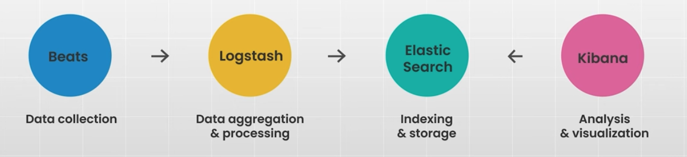

# Elastic Search 

**Elasticsearch** is a **distributed search and analytics engine** used to store, search, and analyze large volumes of data in **near real-time**.

It is:

- **Distributed** → runs across multiple nodes (horizontal scaling)
- **NoSQL** → schema-free, document-oriented
- **JSON-based** → data stored as JSON documents
- **Accessed via REST APIs**

It can ingest Logs, Metrics, Application traces, Business data and many more. 

**And make them searchable instantly.**

## Features

1. Full Text Search
2. Aggregations
3. Geospatial Search
4. Near real-time indexing and querying 
5. Schema Flexibility

## Under The Hood

At its core, ElasticSearch uses **Apache Lucene**

Lucene is responsible for:

- Indexing data
- Efficient search algorithms
- Scoring relevance

ElasticSearch is essentially a **distributed layer built on top of Lucene**.

## Comparison with RDBMS

| RDBMS    | ElasticSearch |
| -------- | ------------- |
| Database | Index         |
| Table    | Index Pattern |
| Row      | Document      |
| Column   | Field         |
| Schema   | Mapping       |

Example:

```
{
  "name": "Saurav",
  "age": 25,
  "skills": ["ML", "Backend"]
}
```

This is a **document** stored inside an **index**.

## ELK Stack (Ecosystem)



### 1. E — Elasticsearch

- Stores and indexes data
- Provides fast search and analytics

### 2. K — Kibana

- Web-based UI
- Used for:
  - Dashboards
  - Visualizations
  - Monitoring logs

### 3. Logstash

- Server-side data processing pipeline
- Steps:
  - **Input** → collect data
  - **Filter** → transform/clean
  - **Output** → send to ElasticSearch

### 4. Beats

- Lightweight agents installed on servers
- Used to ship data

Examples:

- Filebeat → logs
- Metricbeat → system metrics

## How Searching Works in Elastic Search ?

### Step 1: Indexing (Before Search Happens)

When data is inserted : 

1. JSON document is sent via REST API
2. ElasticSearch processes it
3. Text fields are analyzed using:
   - Tokenization (split text into words)
   - Lowercasing
   - Removing stop words (like "is", "the")

Example:

```
"Elastic Search is powerful"
↓
["elastic", "search", "powerful"]
```

### Step 2: Inverted Index Creation 

This is the **core concept**.

Instead of storing:

```
Doc → Words
```

ElasticSearch stores:

```
Word → List of Documents
```

Example:

| Word     | Documents |
| -------- | --------- |
| elastic  | 1, 2      |
| search   | 1         |
| powerful | 2         |

This structure is called an **inverted index**.

### Step 3: Query Processing

When you search:

```
"elastic search"
```

1. Query is also analyzed (same process as indexing)

2. Tokens are generated:

   ```
   ["elastic", "search"]
   ```

3. ElasticSearch:

   - Looks up these tokens in inverted index
   - Finds matching documents

### Step 4: Relevance Scoring

ElasticSearch ranks results using:

**TF-IDF / BM25 (default)**

- **TF (Term Frequency)** → how often word appears in doc
- **IDF (Inverse Document Frequency)** → how rare the word is

More important words = higher score

### Step 5: Distributed Search

Since ElasticSearch is distributed:

- Data is split into **shards**
- Query runs on multiple shards in parallel
- Results are merged and sorted

### Step 6: Near Real-Time Search

- Data is not immediately searchable
- It becomes searchable after a **refresh (~1 sec)**

## How Fuzzy Search Happens ?

1. ElasticSearch (via Apache Lucene) uses **Levenshtein Distance** to allow small typos (insert, delete, replace characters).
2. Query with `"fuzziness"` generates **similar terms** (e.g., `"elastc"` → `"elastic"`).
3. These variations are searched in the **inverted index** (not full scan).
4. Results are **ranked by relevance** → exact match > fuzzy match.
5. Performance is controlled using:
   - `fuzziness`
   - `prefix_length`
   - `max_expansions`

**Edit Distance** (specifically **Levenshtein Distance**) is the **minimum number of operations required to convert one string into another**.