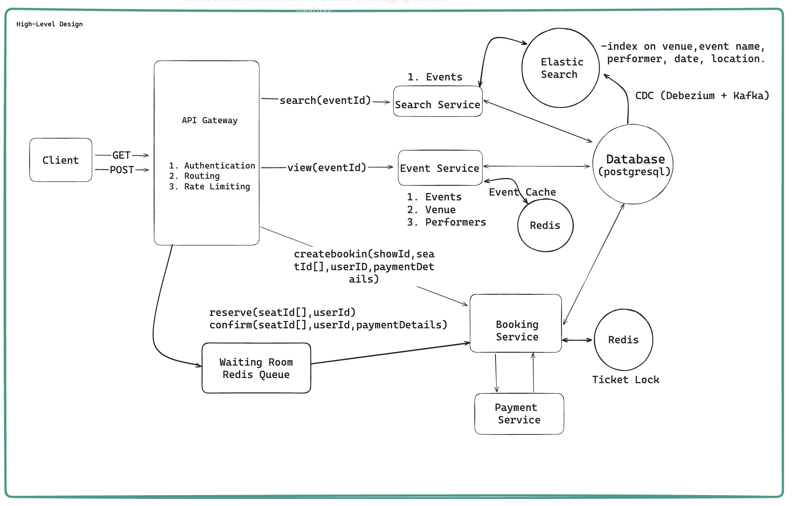

# BookMyShow

## 1. Requirements

### Functional Requirements

i. User should be able to view events

ii. User should be able to book tickets

iii. User should be able to search for events

### Non Functional Requirements

i. Prioritize availability for searching and viewing events

ii. Prioritize consistency for booking event. ( No Double Booking )

iii. Low Latency Search (<500ms)

iv. System is read heavy. (100:1) read>>write. Support high read throughput. 


## 2. Capacity Estimation

### Assumption

DAU : 10M users

Peak traffic during popular events (concert/movie release)

Read-heavy system (browsing/search >> booking)

### Traffic Estimation

#### i. Read Requests ( Search + View Events )

Total reads/day : If each user does 10 reads then

```
= 10M × 10 = 100M requests/day
```

Requests per second (RPS):

```
= 100M / (24 × 3600) ≈ 1157 RPS
```

During Peak Hours = 5*Normal = 5k-6k RPS

#### ii. Write Request ( Bookings )

1% of total users do booking. 

Bookings/day:

```
= 10M × 1% = 100K bookings/day
```

RPS:

```
≈ 1–2 RPS (normal)
≈ 50–100 RPS (peak events)
```

### Storage Estimation

#### i. Event Data

- 100K events/day
- Each event ≈ 1 KB

```
= 100K × 1 KB = 100 MB/day
≈ 36 GB/year
```

#### ii. Booking Data

- 100K bookings/day
- Each booking ≈ 1 KB

```
= 100 MB/day
≈ 36 GB/year
```


## 3. Core Entities

- Events
- Users
- Venues
- Performers
- Ticket/Show Seats
- Shows 
- Bookings

## 4. API Routes

### View Events

```http
// View events
GET /events/:eventId -> Event & Venue & Performer & Ticket[]
- tickets are to render the seat map on the Client
```

### Search For Events

```http
// Search for events
GET /events/search?keyword={keyword}&start={start_date}&
  end={end_date}&pageSize={page_size}&page={page_number} -> Event[]
```

### Book Tickets

```http
// Book tickets to events
POST /shows/:showId/booking -> bookingId
 {
   "seatIds": [], 
   "paymentDetails": {}
  }
```

## 5. High Level Design



# Question

## How will users be able to view simple event details when clicking on an event?

Ans:
From client, user inititates the get api call with specific eventId of the event they wish to view. The request is routed through the api gateway to the event service. The event service queries the primary database for the event details associated with the eventId. The query also retreived the relevant Venue, Event Details, Tickets Available and Performer information to provide comprehensive details.

---

## How will users be able to search for events?

Ans:
To enable user to search for events, we will introduce a search functionality into our system design. When a user inputs search criteria such as keyword for event, date range, location or category, into client application, the client send an get api request with those detail as parameters. This requested is routed through the api gateway to the search service. This search service queries the primary database, filtering the event based on input criteria. This involves searching through the event based on names, date range, location and category to find the matching events. Once the search service retreives the list of events that meet the search criteria, it returns data to the client. The client application then display the search result.

---

## How will users be able to book specific seats for events/show?

Ans:
To enable user to book tickets for a events, we'll introduce a search functionality into our system design. When user selects an event and choose a particular show for that event into client application, the client send an post request with showId, seatIds and payment information to the booking service. This request is routed through the API gateway to the Booking service. The booking service interacts with third party payment service such as paytm, gpay or phonepay to complete the payment. Once completed we can update the ticket row in the database to indicate that ticket/seat is sold or booked.

---

## How would you design a two-phase booking system to prevent users from losing seats during checkout?

Implement a two-phase booking process:

1. Seat Reservation: Temporarily hold selected seats.  
2. Booking Confirmation: Finalize purchase within a time limit.

Ans:

To implement the two phase booking process and prevent users for losing seats during checkout, we'll use a distributed lock system with Redis and a 10-minute TTL ( Time to Live). When a user selects a seat to reserve, the client send a post request to the Booking service with the selected seats. The booking service attempts to acquire lock for these seats in redis, setting a ttl of 10 minutes for each lock. We use Redis atomic SET NX with TTL to both check and acquire locks in one step, avoiding race conditions. This reservation ensures that no other user can reserve or book the same seats during that period. If the user completes the purchase within the TTL window, the Booking service finalized the booking by updating the ticket/seat status to booked/sold. If the user doesnt complete the payment within the time, the lock automatically expires due to the TTL, and the seat becomes available for other to reserve. This mechanism effectively prevents seat loss during checkout by exclusively holding seats for the user and automatically releasing them if the reservation times out.

---

## How can your design scale to support up to 10M concurrent users reading event data?

Ans:
To scale our system to support up to 10M concurrent users reading event data, we'll optimize both on application layer and data layer. On the application side, we can scale the event service horizontally by adding more server instances behind a load balancer. This ensures we can handle massive influx of incoming request without overwhelming any single server. For the data layer, we will implement caching mechanism to reduce load on our primary database. Since data doesnt change very frequently, we can use in-memory cache like Redis or Memcache to store and serve event data quickly.

---

## How can you improve search to handle complex queries more efficiently?

Ans:
To improve search to handle complex queries efficiently i will implement Elastic Search, which will allow us to support text-based search and fuzzy search. We will index all relevant event data such venue, event name, performer name, date and location into Elastic Search. When a user performs a search, the Search Service will query Elasticsearch instead of the primary database. Elasticsearch is optimized for handling complex full-text searches and can process queries with low latency, even under high load. This allows us to efficiently handle intricate search terms and provide quick, relevant results to the user. To ensure data consistency between our primary database and Elasticsearch, we’ll implement Change Data Capture (CDC). CDC is implemented using Debezium, which watches DB changes in real-time and Kafka propagate them to Elasticsearch.

---

## How would you implement a virtual waiting room that queues users for popular events and grants access based on their queue position?

Ans:
We can implement a virtual waiting room using Redis Sorted Sets. Redis supports multiple data structure such as string,list, sets, sorted sets, hashes. So here we need to implement order queue so we use sorted sets. So each user is enqueued with their timestamp as the score to maintain their FIFO order. Every N minutes, or based on the numberof completed bookings, we use ZRANGE to pull users from the waiting room (queue) and grant them access to event booking service page in a controlled manner, throttling the number of concurrent bookings and preventing system overload. This approach enables fairness and provides scalibility to handle surges in traffic.