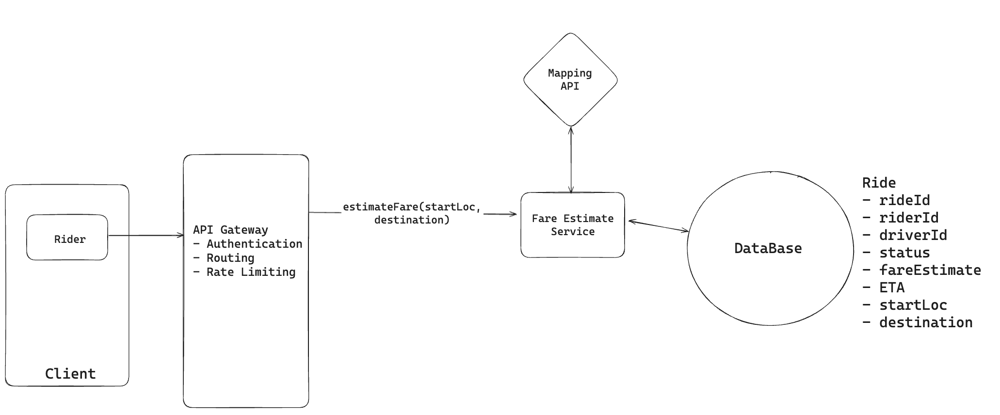
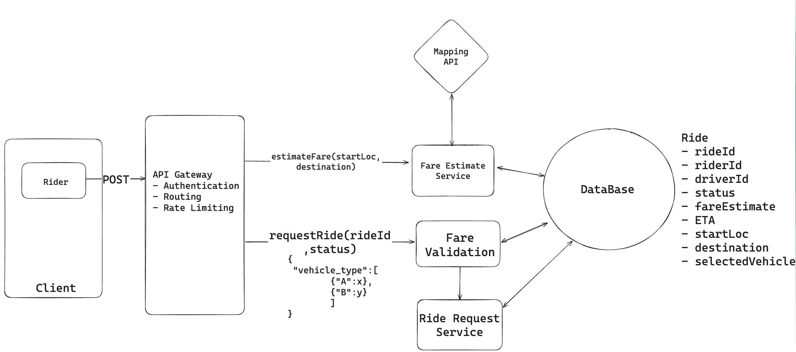
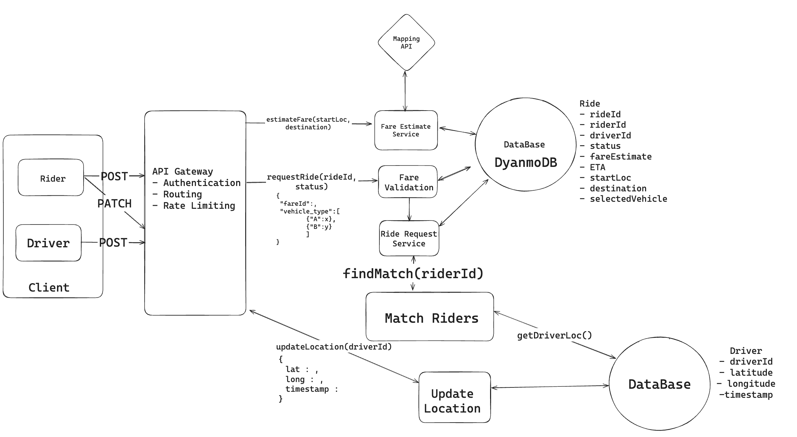
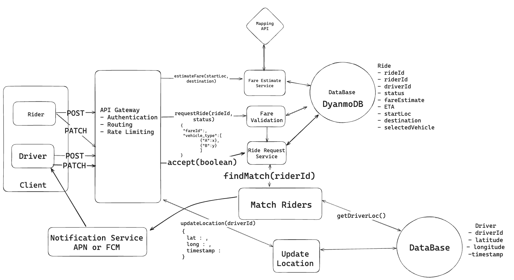
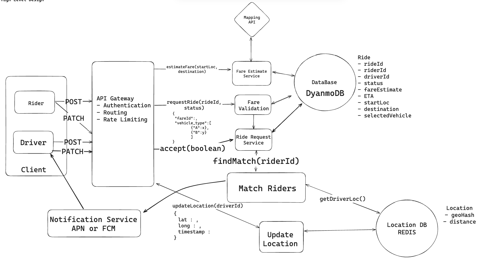
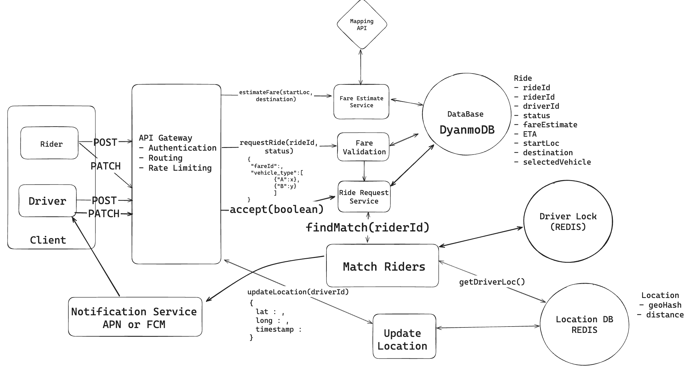
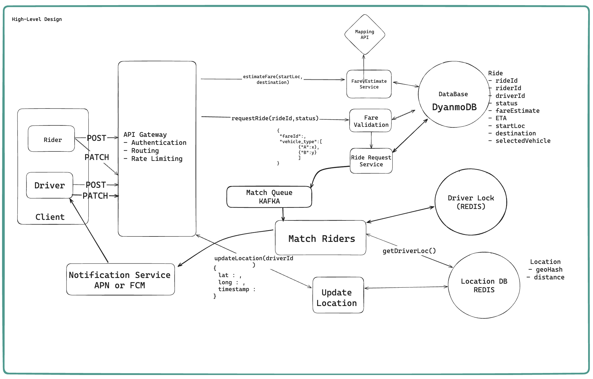

# Uber

## 1. Requirements

### Functional Requirements

i. Riders should be able to input start location and a destination and get a fare estimate

ii. Riders should be able to request a ride based on the estimated fare. 

iii. Driver should be able to accept/decline a request and navigate to pickup/drop-off

### Non-Functional Requirements

i. Highly Available For Rider (Low Latency ride match <1min).

ii. Consistency in case of Driver, two driver shouldnt accept a same request.

iii. Navigation should be highly available and eventual consistency for updates 
across rider and driver apps.

iv. Handle Traffic Surges and Burst. ( Scale to high throughput during peak times )

## 2. Capacity Estimation

### Assumptions

- 10M daily active riders
- 2M active drivers
- ~1M rides per day
- Peak traffic = 10x average

#### 1. Ride Requests

- 1M rides/day
- Avg ≈ 12 RPS
- Peak ≈ **30 RPS**

#### 2. Fare Estimate Requests

- ~2.5M–3M/day (users check multiple options)
- Avg ≈ 35 RPS
- Peak ≈ **300–350 RPS**

#### 3. Driver Location Updates (most critical)

- 2M active drivers
- Update every 5 seconds

→ 2,000,000 / 5 = **400K writes/sec**
→ Peak burst ≈ **500K–600K writes/sec**

This is the highest load in the system.

#### 4. Matching Requests

- ~1M matches/day
- Avg ≈ 12 RPS
- Peak ≈ **25–30 RPS**
- Each match triggers multiple Redis geo lookups, so effective read load ≈ 150–300 ops/sec

#### 5. Notifications

- ~2M–3M notifications/day
- Peak ≈ **200–500 RPS bursts**

#### 6. Storage

- Ride record ≈ 1–2 KB
- ~1M rides/day → **~1–2 GB/day**
- ~400KB–1GB Redis in-memory footprint for live driver locations

System is heavily **write-dominated due to driver location updates**

## 3. Core Entities

1. Rides
2. Rider 
3. Driver 
4. Vehicles
5. Location

## 4. API Routes

### Get Fare Estimate

```http
post /fare/estimate -> fareId & status & estimates[] 
{
  "startLocation":[],
  "destination":[]
}
```

### Ride Request

```http
post /ride/request -> rideId & status //Searching Driver
{
	"fareId":,
  "vehicle_type":
}
```

### Driver Response

```http
patch /ride/:rideId/driver-response-> rideId & status //Accepted or Searching Driver
{
  "action":accept/reject
}
```

### Driver Location Update

```http
post /driver/location -> success/failure
{
  lat : ,
  long : ,
  timestamp : 
}
```

**UserId/driverId is not passed in request bodies for security reasons, as it can be spoofed. Instead, identity is extracted from an authenticated token (like JWT) in the Authorization header. The API gateway validates the token and attaches the user/driver context to the request before it reaches backend services.**


## 4. High Level Design 

### How would you give users a estimated fare based on their start location and destination?

From client side, rider initiates a post API call with longitude and latitude of the start location and destination in the request body. The request is routed through the API gateway to fare estimate service. The API Gateway authenticates the request using JWT, extracts the rider’s userId, and attaches it to the request context before forwarding it to the fare estimation service. The fare estimate service then calls a mapping API service to obtain route information, including distance and estimated travel time. Using this data, along with factors like current demand and base rate, the fare estimate service calculates the fares of all types of vehicles. It creates a new Ride entity in the database to store this estimate, associating it with a unique identifier and sets the ride status to "fare-estimated". Finally, the service returns the fare estimate to the rider.



### How will riders be able to request a ride based on the estimated fare?

To enable rider to request a ride based on the estimated fare, we will introduce a ride request functionality into our system design. When a rider request a ride, the client send a post request with fareId and vehicle type. This request is routed through the API gateway to Fare Validation Service. The service first validates that the fare estimate exists and is still accurate. It then creates a new Ride entity in the database with a status of 'searching for driver', associating it with the validated fare estimate and the user's information. Finally, the service returns the created Ride entity back to the client, confirming that the ride request has been completed.



### How does your system match riders to the best driver for their ride?

To enable the system to match riders to the best driver, we introduce a **Match Riders** functionality in our system design. Whenever a ride is requested and the status of the rider changes to **Searching Driver**, it triggers the Matching Service. This service queries the location database to find nearby available drivers. Drivers periodically update the location database by sending a POST request with latitude, longitude, and timestamp to the Update Location Service. This request goes through the API Gateway to the Update Location Service. The Update Location Service updates the database with the current location and timestamp.

The Matching Service uses this data to perform a proximity search. It then selects the best available driver based on factors such as proximity and driver rating, and then sends a ride request to the driver, which they can either accept or deny.



### How does your system notify matched drivers and allow them to accept/decline rides?

Once a driver is matched to a ride request, the **Matching Service** sends a message to the **Notification Service**, which then pushes a notification to the driver’s mobile app with key ride details like pickup location and estimated fare. (*notification delivery via Apple Push Notification service (APNs) and Firebase Cloud Messaging*)

The driver can either accept or reject the request from the app. If the driver responds, the app sends a PATCH Request through the API Gateway to the **Ride Service**. The Ride Service uses the `rideId` to update the ride state in the database. If the driver accepts, the ride status is updated to `ACCEPTED` and the driver is assigned to the ride along with relevant details like driver location and navigation information being shared with the rider and driver apps. If the driver rejects, the Matching Service is triggered again to find another available driver and the process repeats.



### How can you handle the high write throughput from drivers sending location updates every couple seconds and efficiently perform proximity searches for matching?

To handle high write throughput from drivers sending location updates every couple seconds, we can use REDIS. It In-memory writes are extremely fast, has simple over write pattern. We can use Redis with its geospatial indexing capabilities to efficiently handle high write throughput and perform proximity searches. For each driver, we maintain a key in Redis that stores their current location using geohashing. To manage the frequency of updates, we implement dynamic update interval based on the driver status. For instance, active drivers (those available for rides) might send updates every 30 seconds, while idle drivers might update every 5 minutes. This approach significantly reduces the write load on the system.

When we need to find nearby drivers for a ride request, we use Redis's GEOSEARCH command together with the WITHDIST option. This efficiently returns all driver keys within a specified radius and their respective distances, enabling fast ranking. The in-memory nature of Redis allows for extremely fast read and write operations, easily handling millions of concurrent requests.

Additionally, we can deploy multiple instances of the Update Location Service behind a load balancer to handle high throughput and ensure horizontal scalability. Similarly, the Match Rider Service can also be scaled horizontally with multiple instances behind a load balancer to ensure high availability and efficient request handling.



### How would you partition or shard the Redis based location store so proximity searches still work correctly near cell or shard boundaries in a dense city?

We use spatial indexing, where we divide the world into fixed grid cells using Geohash. Each driver is assigned a cell ID based on their location. In Redis, the key is the cell ID, which maps to a set of drivers associated with that cell.

To perform a proximity search, we consider the rider’s current cell along with its eight surrounding neighboring cells (like a grid). This ensures that even if a driver is in a neighboring cell, they are still included in the search if they are nearby.

We also apply horizontal partitioning of the Redis-based location store using consistent hashing, where the Geohash (cell ID) acts as the key. This ensures that all data belonging to the same Geohash is consistently routed to the same shard.


### How do we guarantee each driver receives at most one ride request at a time?

We can use Redis to implement a distributed lock system. When a ride request is sent to a driver, the Ride Matching Service creates a lock in Redis using the driver’s ID as the key, with a TTL of 10 seconds.

If the lock is acquired successfully, the service sends the ride request to the driver. If the driver accepts within 10 seconds, we update the ride status to “accepted” in the database and release the lock. If the driver does not respond within the time window, the lock automatically expires.

This ensures that each driver receives only one ride request at a time. All other concurrent ride-matching attempts first check the lock; if a lock already exists for that driver (indicating a pending request), they skip that driver and move on to the next closest available driver.



### How can we ensure no ride requests are dropped during peak demand periods?

During peak demand periods, many riders will be using the `estimateFare` and `requestRide` features. At the application layer, we can scale these services horizontally by deploying multiple instances behind a load balancer.

We can also introduce Kafka as a buffer to improve durability and absorb traffic spikes. When a ride request is initiated for matching, it is published to a Kafka topic partitioned by geographic region. This allows us to efficiently handle localized demand surges before processing the matching logic.

Each partition is consumed by multiple instances of the Ride Matching Service, which can be dynamically scaled based on queue length and load.

The Ride Matching Service processes messages from the queue and attempts to match riders with available drivers. If a match is successful, the message offset is committed. If not, the request can be retried—either by reprocessing through another consumer instance or by re-queuing with a higher priority—so that another instance of the matching service can handle it.

This approach ensures that no requests are dropped during peak demand, while also providing scalable and efficient processing of ride requests.

